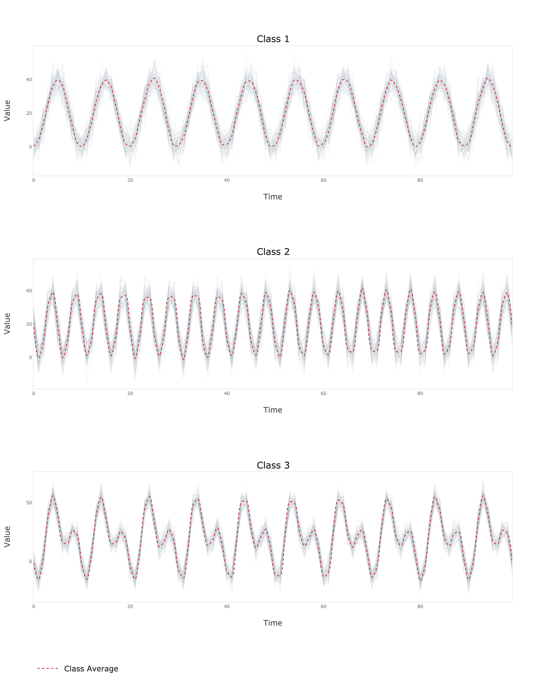

# InceptionTime PyTorch


PyTorch implementation of multivariate time series classification model introduced in Ismail Fawaz, H., Lucas, B., Forestier, G., Pelletier, C., 
Schmidt, D.F., Weber, J., Webb, G.I., Idoumghar, L., Muller, P.A. and Petitjean, F., 2020. InceptionTime:
Finding AlexNet for Time Series Classification. *Data Mining and Knowledge Discovery*, 34(6), pp. 1936-1962.


*Model architecture (source: [doi: 10.1007/s10618-020-00710-y](https://doi.org/10.1007/s10618-020-00710-y))*

## Dependencies
```bash
numpy==1.23.5
torch==1.13.1
scikit-learn==1.1.3
plotly==5.11.0
kaleido==0.2.1
```
## Usage
```python
import numpy as np
from sklearn.model_selection import train_test_split
from sklearn.metrics import accuracy_score

from inception_time_pytorch.model import InceptionTime
from inception_time_pytorch.plots import plot

# Generate the data
N = 60   # number of time series
C = 10   # number of dimensions of each time series
L = 100  # number of samples of each time series
x = np.zeros((N, C, L))
t = np.linspace(0, 1, L)
c = np.cos(2 * np.pi * (10 * t - 0.5))
s = np.sin(2 * np.pi * (20 * t - 0.5))
x[:N // 3] = 20 + 20 * c + 5 * np.random.normal(size=(N // 3, C, L))
x[N // 3: 2 * N // 3] = 20 + 20 * s + 5 * np.random.normal(size=(N // 3, C, L))
x[2 * N // 3:] = 20 + 20 * c + 20 * s + 5 * np.random.normal(size=(N // 3, C, L))
y = np.concatenate([0 * np.ones(N // 3), 1 * np.ones(N // 3), 2 * np.ones(N // 3)])

# Split the data
x_train, x_test, y_train, y_test = train_test_split(x, y, stratify=y, test_size=0.3)

# Fit the model
model = InceptionTime(
    x=x_train,
    y=y_train,
    filters=32,
    depth=6,
    models=5,
)

model.fit(
    learning_rate=0.001,
    batch_size=64,
    epochs=100,
    verbose=True,
)

# Evaluate the model
yhat_train = model.predict(x_train)
yhat_test = model.predict(x_test)
print('Training accuracy: {:.6f}'.format(accuracy_score(y_train, yhat_train)))
print('Test accuracy: {:.6f}'.format(accuracy_score(y_test, yhat_test)))

# Plot the results
fig = plot(x=x_test, y=yhat_test)
fig.write_image('results.png', scale=4, height=900, width=700)
```

